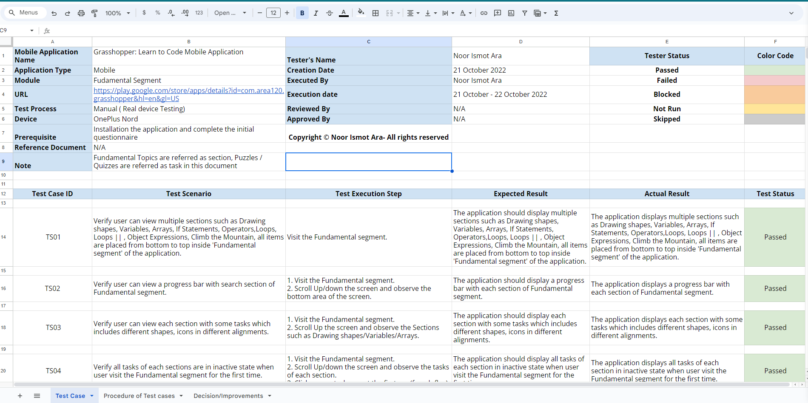

# **Grasshopper: Learn to Code Mobile Application**

**Application Type:** Mobile

**Module:** Fudamental Segment

**URL :** https://play.google.com/store/apps/details?id=com.area120.grasshopper&hl=en&gl=US

**Test Process:** 	Manual ( Real device Testing)

**Device:**	OnePlus Nord

**Prerequisite:** Installation the application and complete the initial questionnaire

**Reference Document:**	N/A

**Note:**	Fundamental Topics are referred as section, Puzzles / Quizzes are referred as task in this document

**Tester:** Noor Ismot Ara

**Execution date:** 21 October - 22 October 2022

**Test Case Creation Date:** 	21 October 2022

**Test Case URL:** https://docs.google.com/spreadsheets/d/1V0HZ9YdITMSXec1P4KG510F-wUmz1moJCvjIHPnPS6I/edit?usp=sharing

## Procedure on how I have Prepared the Test cases

 
1. The very first step is to analyze the aim/functionality of each section of the mobile application 
2. The second step is to make a list of the main functional scenarios and note down the steps to generate the scenarios
3. The third step is to analyze the UI of the mobile application to understand the usability
4. Then make a list of all the test scenarios related to usability and note down the steps to generate the scenarios following a test case template
5. Add the expected result of the test scenarios
6. Then execute the steps to verify /validate each test scenario 
7. Add the expected and Actual result of the test scenarios
8. Write the status of each test scenario as Passed/Failed/Blocked/Not Run/Skipped
9. For evidence, I have used Lightshot tool and for screen recording purpose used Xrecorder app (Both are free)

## What types of tools and language do we need if we want to go for automation testing?

If we want to go for automation testing, appium could be the best choice because :
 
- Open Source Tool
- Supports various languages like Ruby, Java, PHP, Node, Python
- Easy to set up on different platforms
- Supported by all platforms such as iOS, Android, Windows, Linux
- GUI is easy to use 
- Provides Record-and-replay, Cross-browsing functionality, No-code automation, and real devices testing

